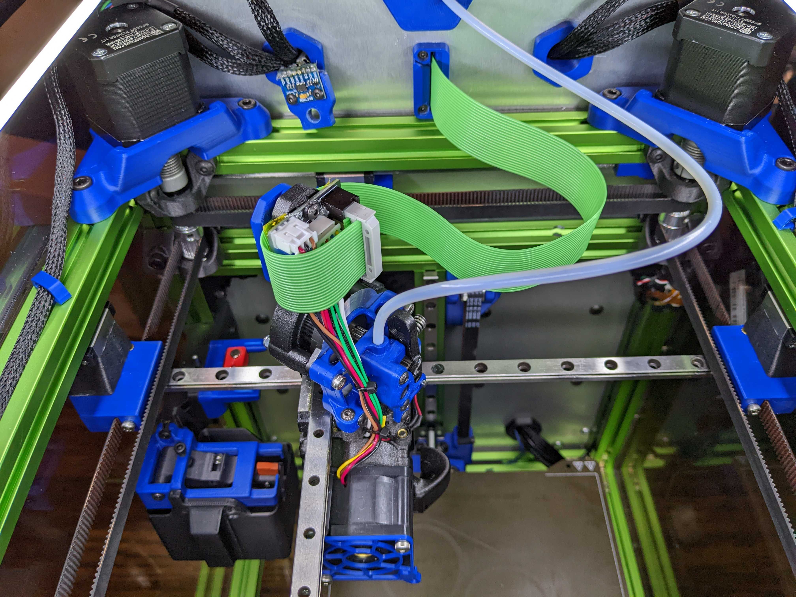

K3 - Roadkill PWM Mod
============
**THIS BOARD IS FOR *K3 only*.**  
***IMPORTANT*** - *Hotend fan and part cooling fan share the same voltage.*
<table width=100%>
<TR><TD width=50%></TD>
       <TD width=50%></TD></TR>
<TR><TD width=50%></TD>
       <TD width=50%></TD></TR>     
<TR><TD width=50%></TD>
       <TD width=50%></TD></TR>     
</TABLE>

**Acknolwedgement:**
 - This toolhead is 100% just a mod of roadkill.  My work merely hackery compared to the initial development by Safflower.  Please give him all the credit he deserves.
 
 **Notes:**
 - The K3 doesn't use some of the features of the RKE2 board such as the omron probe and filament switch, so I streamlined the features somewhat.
 - This board is no longer compatible with the base roadkill.  It is only compatible with itself.
 - Changes
   - 6 wires for the heater.  RKE2 uses 4 wires.  This adds an additional two to allow more for headroom.  
   - Part cooling fan and hotend fan share two wires for (+)
     - Partcooling fan has two wires for (-), which allows more current for the 4028 fan of the frostbite toolhead.
     - My 4028 fan uses 1.3 amps at full power.
     - Adds a line for PWM on the part cooling fan (for frostbite toolhead).
     - ***IMPORTANT*** - *Hotend fan and part cooling fan share the same voltage.*
   - Moved the heater screw terminal into the board a little bit.  You can use the stock side exiting wires or top exiting wires now without the terminal hanging off the side of the board.  
